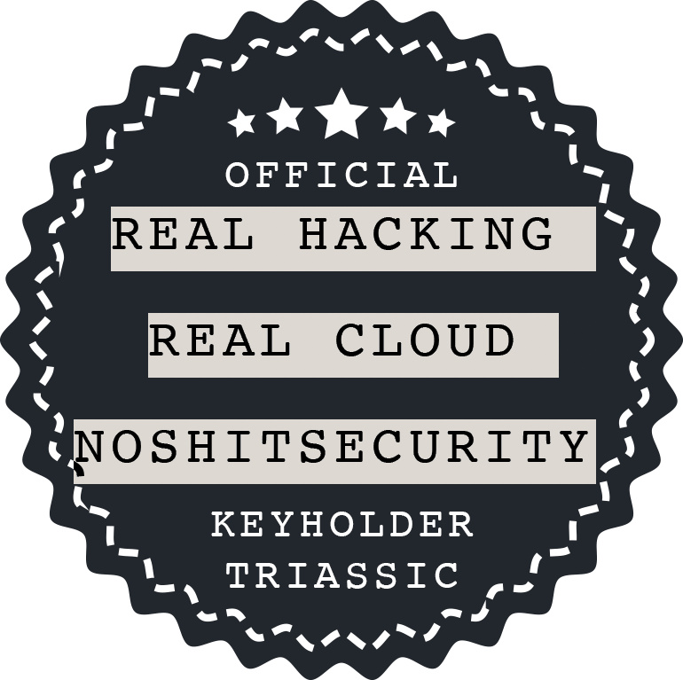

 
 
 

### What the sh*t is going on?

By now you've got questions about the timer, and might want to know what exactly is going on. 
Allow me to explain. 

1. Skills gap won't close itself
2. Told you I was going to teach you to build a lab
3. Held a series of CTFs that showed me who was willing to try harder than anyone else

That last bit landed login credentials, and soon U2F keys into the hands of the 'keyholders.'

They are the first generation of students learning Azure security architecture from yours truly. 
Listed below is the keyholder's agenda, and the hands-on skills they will develop together.  

Cya in 40 days, dinosaurs. 

#### -Shane

  

  

**Azure Security Engineering I** 
**09-14-2020**
  
> "Throughout 2020, 95% of cloud security failures are going to be the customer's fault." 
> -Microsoft, Ignite 2019 (Oren)

  

`Agenda`
  

`1. Conditional Access`

We will demonstrate and discuss what it takes to start building on the best foot-- starting with conditional access and infrastructure-wide multi-factor authentication.   

`2. Containers, Resources, and Resource Groups` 

We will then move into what approaches can be used with resource groups, what things are containers and what things aren't, and how to best leverage IAM with the options you have.  

`3. Networks, Subnets, and Zero Trust Architecture`

We will demonstrate and discuss the nuts and bolts of; and what it takes to build a real enterprise ZTA network the best way-- with the future in mind and assumption of breach present in the arch.  

`4. Storage Accounts, Vaults, and Service and Private Endpoints`

We will demonstrate and discuss the best way to build and use Storage Accounts and Keyvaults in Azure, and cover what Service / Private Endpoints are meant for.   

`5. Policy and Compliance in the Azure cloud`

We will demonstrate and discuss how to scope and apply policies to conform infra with PCI, NIST, Azure CIS Benchmark and other relevant security controls.  

`6 Virtual Machines, limitations with IAM and Azure AD` 

We will demonstrate and discuss how to build resilient virtual machines that conform to availability and failover / fail-back prerequisites, and how to approach each OS style with the best IAM solution possible for the scenario.  

`7. Updates, DR, Backups, and Managed Identities`

We will demonstrate and discuss backups and DR, as well as the best way to approach the idea of a "service account" eg service principal, and what managed identities can do for your infrastructure.  

`8. Operational Excellence and High Availability`

We will go over availability limitations, region fail-back, and the true cost of Azure Firewall, DDoS protection, and doing business in the cloud at the lowest bottom line.    

    
     
  
  <a href="coc">Code of Conduct</a>

